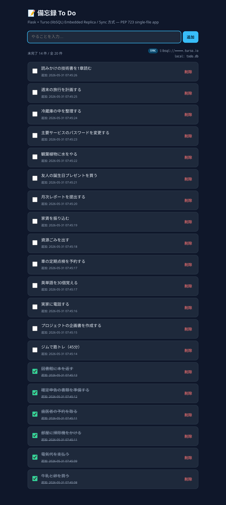

# 📝 備忘録 To Do アプリ (Flask + Turso / Sync 方式)

Python の [Flask](https://flask.palletsprojects.com/) で作った、シンプルな備忘録（To Do）Web アプリです。
データの保存先には [Turso](https://turso.tech/)（[libSQL](https://github.com/tursodatabase/libsql) ベースのエッジ DB）を
**Embedded Replica（同期＝Sync 方式）** で利用します。

Python の実行には [uv](https://docs.astral.sh/uv/) を使い、アプリ本体は
[PEP 723](https://peps.python.org/pep-0723/)（インラインスクリプトメタデータ）に
従った **単一ファイル構成** になっています。依存パッケージは `app.py` 冒頭に
記述されており、`uv run app.py` だけで仮想環境の作成・依存解決・起動まで自動で行われます。

**リポジトリ**: <https://github.com/katzkawai/kklab-flask-turso-todo>

## スクリーンショット



> ローカルで起動し、Turso と同期（`SYNC` バッジ）している状態。完了タスクは取り消し線付きで下部に表示されます。
> （DB エンドポイント URL は公開用に伏せています）

---

## 概要

「やること」をブラウザから追加・完了・削除できる、最小構成の To Do アプリです。

### 主な機能

| 機能 | 説明 |
| --- | --- |
| 追加 | フォームからタスクを追加（前後の空白除去、空入力は拒否） |
| 完了 / 未完了 | チェックボックスで状態を切り替え（取り消し線で表示） |
| 削除 | 確認ダイアログ付きで削除 |
| 並び順 | 未完了を上に、追加が新しい順に表示 |
| 件数表示 | 「未完了 N 件 / 全 M 件」と接続中の DB / 同期状態バッジを表示 |

### Turso Sync 方式（Embedded Replica）とは

このアプリは **ローカルに SQLite のレプリカファイルを持ち、リモートの Turso と同期** します。

```
   ブラウザ ──▶ Flask ──▶ ローカルレプリカ (todo.db)
                              │  ▲
                       sync() │  │ sync()  （pull / push）
                              ▼  │
                        リモート Turso (libsql://…)
```

- **読み取り**: ローカルレプリカから返すため高速。オフラインでも読めます。
- **読み取り前**: `sync()` でリモートの最新を pull します。
- **書き込み**: ローカルへ反映後、`sync()` でリモートへ push します。
- **ネットワーク断時**: 同期だけスキップし、ローカルレプリカで動作を継続します（後述の縮退モード）。

`libsql-client`（純リモート HTTP 接続）ではなく、Embedded Replica に対応した
[`libsql`](https://pypi.org/project/libsql/) パッケージ（旧 `libsql-experimental`）を使用しています。

### 技術スタック

- **言語 / 実行**: Python 3.11+ / [uv](https://docs.astral.sh/uv/)（PEP 723 形式）
- **Web フレームワーク**: Flask 3.x
- **データベース**: Turso (libSQL) **Embedded Replica / Sync 方式** — クライアントは [`libsql`](https://pypi.org/project/libsql/)
- **設定**: `python-dotenv` による `.env` 読み込み
- **画面**: `render_template_string` によるインライン HTML（外部テンプレート不要）

### ファイル構成

```
kklab-flask-turso-todo/
├── app.py          # アプリ本体（PEP 723 メタデータ + Flask + libSQL Sync）
├── .env.example    # 環境変数のサンプル（.env にコピーして使う）
├── .gitignore
└── README.md
```

### データモデル（`todos` テーブル）

| カラム | 型 | 説明 |
| --- | --- | --- |
| `id` | INTEGER | 主キー（自動採番） |
| `title` | TEXT | タスク内容 |
| `done` | INTEGER | 完了フラグ（0 / 1） |
| `created_at` | TEXT | 作成日時（`datetime('now')`） |
| `updated_at` | TEXT | 更新日時（`datetime('now')`） |

テーブルはアプリ起動時に `CREATE TABLE IF NOT EXISTS` で自動作成され、同期されます。

---

## 前提条件

- **uv** がインストール済みであること
  ```bash
  curl -LsSf https://astral.sh/uv/install.sh | sh
  ```
  （Python 本体は uv が必要に応じて取得します）
- Turso と同期する場合は **Turso アカウント** と **Turso CLI**
  （未設定でもローカルレプリカ単体で動作します）

---

## 起動方法

### 0. リポジトリを取得

```bash
git clone https://github.com/katzkawai/kklab-flask-turso-todo.git
cd kklab-flask-turso-todo
```

### 1. まず動かす（同期なし・ローカル単体）

`TURSO_DATABASE_URL` が未設定なら、ローカルのレプリカファイル `todo.db` 単体（同期なし）で動作します。
とりあえず試したい場合はこれだけで OK です。

```bash
uv run app.py
```

ブラウザで **http://127.0.0.1:5000** を開きます。
初回は uv が依存パッケージを自動インストールするため少し時間がかかります。

### 2. Turso と同期する（Sync 方式）

#### (a) Turso のデータベースを用意

```bash
# Turso CLI のインストール（未導入の場合）
curl -sSfL https://get.tur.so/install.sh | bash

# ログイン
turso auth login

# データベースを作成
turso db create kklab-todo

# 同期先 URL を確認（libsql://... が表示される）
turso db show kklab-todo --url

# 認証トークンを発行
turso db tokens create kklab-todo
```

#### (b) 環境変数を設定

`.env.example` をコピーして `.env` を作成し、上で取得した値を設定します。

```bash
cp .env.example .env
```

```dotenv
# .env
TURSO_DATABASE_URL=libsql://kklab-todo-xxxx.turso.io   # sync_url（同期先）
TURSO_AUTH_TOKEN=eyJhbGciOi...（発行したトークン）
FLASK_SECRET_KEY=任意のランダムな文字列
```

> `.env` は秘密情報を含むため `.gitignore` で除外しています。コミットしないでください。

#### (c) 起動

```bash
uv run app.py
```

起動ログに同期モードが表示されます。

```
 * 備忘録 To Do を起動します  ->  http://127.0.0.1:5000
 * DB: Sync 方式 (remote=libsql://kklab-todo-xxxx.turso.io, local=todo.db)
```

画面右上のバッジで現在の状態が分かります。

| バッジ | 意味 |
| --- | --- |
| 🟦 `SYNC` | Turso と同期中（Embedded Replica） |
| 🟧 `SYNC・オフライン` | Sync 指定だがリモートに繋げず、ローカルへ縮退中 |
| ⬜ `LOCAL` | 同期なし（ローカル単体） |

### 環境変数一覧

| 変数 | 既定値 | 説明 |
| --- | --- | --- |
| `TURSO_DATABASE_URL` | （空） | 同期先 URL（sync_url）。設定すると Sync 方式が有効 |
| `TURSO_AUTH_TOKEN` | （空） | Turso の認証トークン（Sync 方式で必須） |
| `TURSO_SYNC_LOCAL_PATH` | `todo.db` | ローカルに置くレプリカファイルのパス |
| `TURSO_SYNC_INTERVAL` | （なし） | バックグラウンド自動同期の間隔（秒）。未設定なら手動同期のみ |
| `TURSO_REQUIRE_SYNC` | （空） | `1` でリモート接続必須（繋げないと縮退せず即エラー） |
| `FLASK_SECRET_KEY` | `dev-secret-change-me` | セッション署名鍵（本番では必ず変更） |
| `HOST` | `127.0.0.1` | 待ち受けホスト |
| `PORT` | `5000` | 待ち受けポート |
| `FLASK_DEBUG` | `1` | デバッグモード（`0` で無効） |

例: ポートを変えて LAN に公開する場合

```bash
HOST=0.0.0.0 PORT=8080 FLASK_DEBUG=0 uv run app.py
```

---

## 仕組みのポイント

- **PEP 723**: `app.py` 先頭の `# /// script ... # ///` ブロックに依存関係を記述。
  `uv run app.py` 実行時に uv がこのメタデータを読み取り、隔離環境で依存を解決します。
  （`uv run python -c ...` のようにスクリプトを直接実行しない場合はメタデータが
  読まれない点に注意してください）
- **Sync 方式 (Embedded Replica)**: `libsql.connect(local, sync_url=..., auth_token=...)`
  でローカルレプリカを開き、`conn.sync()` でリモートと pull / push します。
  読み取り前と書き込み後に同期するため、最新状態を保ちつつ高速に読み出せます。
- **単一接続 + ロック**: Embedded Replica はローカルファイルに紐づくため、接続は
  プロセスで 1 本だけ保持し、Flask のスレッド間共有に備えて `threading.Lock` で直列化します。
- **縮退モード**: リモートに繋げない場合（資格情報ミス・ネットワーク断など）は、
  `TURSO_REQUIRE_SYNC=1` でない限りローカルレプリカで縮退起動し、アプリは動き続けます。
  この間バッジは `SYNC・オフライン` になり、同期は行われません。
- **安全性**: プレースホルダ（`?`）を用いたパラメータ化クエリで SQL インジェクションを防止しています。

---

## トラブルシューティング

| 症状 | 対処 |
| --- | --- |
| `ModuleNotFoundError: libsql` | `python app.py` ではなく **`uv run app.py`** で起動してください（PEP 723 を読むため） |
| バッジが `SYNC・オフライン` になる | `TURSO_DATABASE_URL` / `TURSO_AUTH_TOKEN` を確認。`turso db tokens create` でトークン再発行。起動ログの警告に失敗理由が出ます |
| 同期できないとき起動を止めたい | `TURSO_REQUIRE_SYNC=1` を設定（繋げない場合は即エラー終了） |
| ポートが使用中 | `PORT=5001 uv run app.py` のように別ポートを指定 |
| ローカルを初期化したい | レプリカ `todo.db`（および `todo.db-*`）を削除して再起動 |
| リモートを初期化したい | `turso db shell <db> "DELETE FROM todos"` |

---

## デプロイ（Render / Railway）

データの正本はクラウドの Turso にあり、ローカルの `todo.db` は Embedded Replica の
**キャッシュ**に過ぎません。そのため Render / Railway のような揮発性ファイルシステムの
PaaS にもそのままデプロイできます（再デプロイ時はレプリカを Turso から再 pull します）。

### 共通の準備

1. リポジトリを GitHub に push 済みにする。
2. Turso の接続情報を用意（`turso db show <db> --url` / `turso db tokens create <db>`）。
3. デプロイ先の **環境変数** に以下を設定する。`.env` は `.gitignore` 済みで
   **デプロイされない**ため、プラットフォーム側の環境変数で渡します。

| 変数 | 値 | 区分 |
| --- | --- | --- |
| `TURSO_DATABASE_URL` | `libsql://<db>-<org>.turso.io` | 必須 |
| `TURSO_AUTH_TOKEN` | 発行したトークン | 必須 |
| `FLASK_SECRET_KEY` | 強いランダム値（下記コマンドで生成） | 必須 |
| `TURSO_SYNC_LOCAL_PATH` | `/tmp/todo.db`（書き込み可能なパス） | 推奨 |
| `TURSO_REQUIRE_SYNC` | `1`（Turso へ繋げないときは起動失敗させる） | 推奨 |
| `FLASK_DEBUG` | `0` | 推奨 |
| `PORT` | プラットフォームが自動注入（設定不要） | 自動 |

```bash
# FLASK_SECRET_KEY の生成例
python -c "import secrets; print(secrets.token_hex(32))"
```

### 起動コマンド（本番は WSGI サーバー推奨）

Flask 開発サーバー（`uv run app.py`）でも動きますが、本番では gunicorn を推奨します。
PEP 723 の単一ファイル構成を保ったまま、uv で依存を解決して gunicorn を起動できます。

```bash
uv run --with gunicorn --with flask --with libsql --with python-dotenv \
  gunicorn -w 1 --threads 8 -b 0.0.0.0:$PORT app:app
```

> ⚠️ **ワーカーは 1 に固定**してください。Embedded Replica はローカルの単一レプリカファイルに
> 紐づくため、`-w 2` 以上にすると各プロセスが別レプリカを持ち競合します。
> 同時実行数は `--threads` で増やします（アプリ側は `threading.Lock` で直列化済み）。

### Render の場合

**(A) Dashboard で設定**

1. New → **Web Service** → 対象リポジトリを選択。
2. **Build Command**: `pip install uv`
3. **Start Command**:
   ```
   uv run --with gunicorn --with flask --with libsql --with python-dotenv gunicorn -w 1 --threads 8 -b 0.0.0.0:$PORT app:app
   ```
4. **Environment** に共通の環境変数を設定 → **Deploy**。

**(B) Blueprint（`render.yaml` をリポジトリ直下に置く）**

```yaml
services:
  - type: web
    name: kklab-flask-turso-todo
    runtime: python
    plan: free
    buildCommand: pip install uv
    startCommand: uv run --with gunicorn --with flask --with libsql --with python-dotenv gunicorn -w 1 --threads 8 -b 0.0.0.0:$PORT app:app
    envVars:
      - key: TURSO_DATABASE_URL
        sync: false          # ダッシュボードで手入力（秘匿）
      - key: TURSO_AUTH_TOKEN
        sync: false
      - key: FLASK_SECRET_KEY
        generateValue: true  # 自動生成
      - key: TURSO_SYNC_LOCAL_PATH
        value: /tmp/todo.db
      - key: TURSO_REQUIRE_SYNC
        value: "1"
      - key: FLASK_DEBUG
        value: "0"
```

### Railway の場合

1. New Project → **Deploy from GitHub repo** → 対象リポジトリ。
2. **Variables** に共通の環境変数を設定（`PORT` は Railway が自動注入）。
3. **Settings → Deploy** の Start Command に上記の `uv run ... gunicorn ...` を指定。
   ビルドで uv が要るため Build Command（または Nixpacks 設定）に `pip install uv` を追加。
4. Python が自動検出されず uv が入らない場合は、リポジトリ直下に最小の
   `requirements.txt` を置くと安定します（この場合は uv 不要）。

   ```text
   # requirements.txt（クラウドのネイティブビルダー用）
   flask>=3.0
   libsql>=0.1.0
   python-dotenv>=1.0
   gunicorn
   ```
   起動コマンドは `gunicorn -w 1 --threads 8 -b 0.0.0.0:$PORT app:app` で OK。
   （`requirements.txt` はクラウド用。ローカルの `uv run app.py` は引き続き PEP 723 を使います）

### 注意点（重要）

- **`$PORT` にバインド**: ポートはハードコードせず、プラットフォームが割り当てる `0.0.0.0:$PORT` を使う。
- **秘密情報は環境変数で**: `.env` はデプロイされません。`TURSO_AUTH_TOKEN` 等は必ずプラットフォームの環境変数に設定。
- **ファイルシステムは揮発性**: 再デプロイ・再起動でコンテナは初期化されますが、ローカルレプリカは
  毎回 Turso から再 pull されるため**データは失われません**（正本は Turso）。書き込み可能なパス
  （例 `/tmp/todo.db`）を `TURSO_SYNC_LOCAL_PATH` に指定。レプリカを永続化したい場合は
  Render Disk / Railway Volume をマウントしてそのパスを指定します。
- **インスタンス / ワーカーは 1 つに**: Embedded Replica の特性上、複数インスタンスや `-w 2` 以上は
  各自が別レプリカを持ち、結果整合・書き込み競合の原因になります。スケールは `--threads` で行う。
- **`TURSO_REQUIRE_SYNC=1` 推奨**: 未設定だと Turso へ繋げないとき**ローカル単体で縮退起動**し、
  書き込みが Turso に届かず再デプロイで失われます。本番は繋げないとき起動失敗させる方が安全。
- **`FLASK_DEBUG=0`**: 本番でデバッガを露出させない。
- **開発サーバーの限界**: `uv run app.py` は Flask 開発サーバー。低トラフィックの個人利用なら可ですが、本番は gunicorn 推奨。
- **無料プランのスリープ**: 無料枠はアイドルでスリープし、初回アクセスでコールドスタート（レプリカ再 pull を含む）が発生します。

---

## 更新履歴

### v1.2.0 — 2026-05-31
- GitHub にリポジトリを公開: <https://github.com/katzkawai/kklab-flask-turso-todo>
- README にリポジトリ情報と `git clone` での取得手順を追記。
- `.gitignore` を整備し、`.env`（秘密情報）・`todo.db*`（Embedded Replica の
  `-info` / `-shm` / `-wal` 含む）・`*.log` を除外。秘密情報がリポジトリに含まれないことを確認。
- アプリ画面のスクリーンショット（`docs/screenshot.png`）を README に追加。
- MIT ライセンス（`LICENSE`）を追加。
- Render / Railway へのデプロイ手順と注意点（`$PORT` バインド・環境変数・揮発性 FS と
  Embedded Replica・ワーカー数・`TURSO_REQUIRE_SYNC` など）を README に追記。

### v1.1.0 — 2026-05-31
- **DB アクセスを Turso Sync 方式（Embedded Replica）へ変更。**
  - クライアントを `libsql-client`（純リモート）から `libsql`（Embedded Replica 対応）へ変更。
  - ローカルレプリカ（`todo.db`）を保持し、読み取り前・書き込み後に `conn.sync()` で
    リモート Turso と pull / push するよう実装。
  - 単一接続を `threading.Lock` で直列化し、Flask のマルチスレッドでも安全に動作。
  - リモートに繋げない場合はローカルへ**縮退起動**（`TURSO_REQUIRE_SYNC=1` で同期必須にも切替可）。
  - 画面に同期状態バッジ（`SYNC` / `SYNC・オフライン` / `LOCAL`）を追加。
  - 環境変数を追加: `TURSO_SYNC_LOCAL_PATH` / `TURSO_SYNC_INTERVAL` / `TURSO_REQUIRE_SYNC`。

### v1.0.0 — 2026-05-31
- 初版リリース。
- Flask 3.x によるブラウザ操作対応の備忘録（To Do）アプリを実装。
- バックエンド DB に Turso (libSQL) を採用（`libsql-client` 経由のリモート接続）。
- PEP 723 形式の単一ファイル構成にし、`uv run app.py` での起動に対応。
- 機能: タスクの追加 / 完了・未完了の切り替え / 削除 / 件数表示。
- パラメータ化クエリによる SQL インジェクション対策、空入力のバリデーションを実装。
- `.env`（`python-dotenv`）による設定読み込みに対応。
- ダークテーマのインライン UI（外部テンプレート・静的ファイル不要）。

---

## ライセンス

[MIT License](LICENSE) の下で公開しています。© 2026 Katz Kawai

個人利用・学習用のサンプルです。自由に改変してご利用ください。
